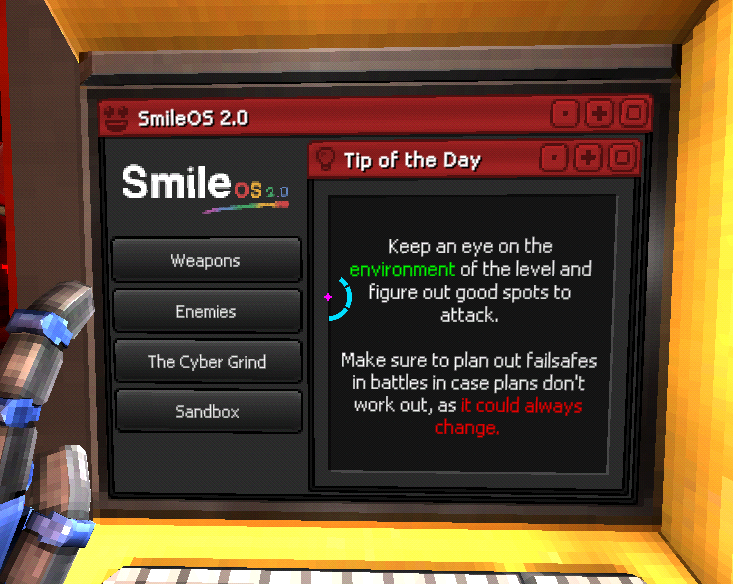

import Tabs from '@theme/Tabs';
import TabItem from '@theme/TabItem';

# Tip Of The Day

The tip of the day shows up in the terminal on every level. Each level has its own tip, usually pertaining to either teach new mechanics or assist in certain scenarios in the level.
You can add your own tip of the day in your levels, and this is how.

Somewhere in the folder you store your level data, make a `TipOfTheDay` file, by right clicking in the folder and going to `Create/ULTRAKILL/TipOfTheDay`
In this file, type whatever you want your tip to be.

:::tip[Tip with writing Tips]
This file, and any text displayed in-game, supports Unity's TMP rich text, so you can add colours, bolding, whatever Unity can do, you can do.
:::

After you are finished writing your tip, select the `Level Info` object in your level scene, and drag the file into the `Tip Of The Day` variable. If you playtest the level, you should see your tip visible in game!

