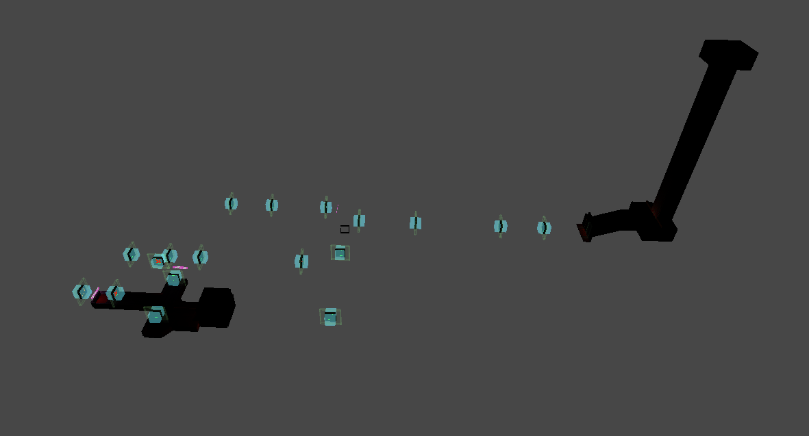

# Optimization

## Intro

Maps can be quite heavy for some PCs to run, especially if they are big and open. So you need to optimize them in order to create a smooth experience. Here you will learn how to do that.

## Deactivating rooms

All official ULTRAKILL maps use this way of optimization. It works by simply deactivating rooms and activating them only when the player enters neighboring rooms.

'Door' component can act as an object activator. There are 2 tabs, for activating and deactivating rooms.

>
--IMPORTANT NOTE--

>
>	For a smooth transition between rooms it's better to have 3 rooms activated at once (i.e. one behind the player, one in front of the player, and the room with the player). And the room that is deactivate must be the one that is 1 room behind the player. 
>
>Like this:
>![Door-with-rooms]

:::warning
Try not to create an excessive amount of faces, edges, and vertices as it will decrease the performance of the level.
:::
Info and pictures were taken from the [Tundra Wiki](https://docs.tundra.pitr.dev/guides/optimization)

