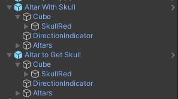
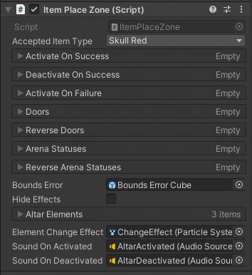

# Intro

Skulls are basically the keys of ULTRAKILL. You use them to open doors, activate events, things of that sort. This tutorial will tell you how to set up and use skulls in your own levels, as well as creating buttons for similar purposes.

## Skulls and Altars

All of the altars are located in `ULTRAKILL Assets/Prefabs/Levels/Interactive`, right at the top of the list. For this, we'll pick a red skull altar. 2 of them, actually. One with the skull, and one for the skull to be placed on. Once you bring the prefabs into your scene, their innards should look something like this:

Let's go through these items step by step.

- `Cube` is the spot where the skulls, or any item, get placed. Inside it is a script called `ItemPlaceZone`, which we will talk about in a moment.
- `SkullRed` is, obviously, the red skull. It turns on and off based on whether or not the skull has been placed there. It's got a script called `ItemIdentifier`, giving details about how it is as a held item, as well as events for when the item is picked up or put down.
- `DirectionIndicator` is just... there. It's an empty `GameObject` in front of the altar. It's unclear what the actual purpose for it is, as none of the other objects use it in any way. If we figure out what it does, this page will be updated accordingly. For now, just ignore it and pretend it isn't there.
- `Altars` is a container for all the altars. It contains the torch, blue and red skull altars. Unless you for some reason want to go through the effort of manually changing the type of altar it is, don't touch this.

If you're just making a level, `Cube` and `SkullRed` (or `SkullBlue` if you have the blue altar) are all you really need to worry about. If it's enabled, the altar will start with having the skull placed on it. Likewise, if it's disabled, it'll be an empty altar. If we want the altar to actually do things when you take/place the skull, head over to `Cube`, and look at `ItemPlaceZone`.

There are quite a few lists here, so let's just go over the ones you'll actually use.

- `Activate On Success` is a `GameObject` list, of which it will activate all of the objects in the list when the right item is placed on the altar. Plus, it'll automatically disable these objects when the item is taken back.
- `Deactivate On Success` is the same as the above `Activate On Success`, but it'll disable the listed objects when the item is placed, and enable them when it's taken back.
- `Activate On Failure` is the same as the above `Activate On Success`, but it only activates/deactivates the objects when the WRONG item is placed/taken. For example, you could use this to play an error sound effect if the player places a red skull on a blue altar, or a blue skull on a torch altar.
- `Doors` is actually (slightly) different than the above. It is a `Door` list, and will open all of the doors in the list when the correct item is placed. It will also close them if it's taken back.

Since `Reverse Doors`, `Arena Statuses` and `Reverse Arena Statuses` are less clear to figure out what they do, it's better to use an `ObjectActivator` connected to the properly covered lists if you want to activate arenas or lock doors.

Feel free to use these to open your doors, create special areas, spawn enemies as a trap, whatever you want!

## Buttons

**WORK IN PROGRESS**
