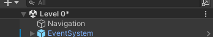
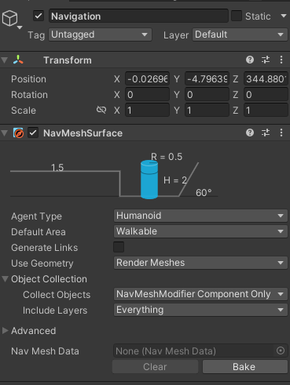

# Enemy Navigation

## What is a NavMesh?

For enemies to walk, they need a ground to do so. However they need to be told what is and isn't ground, as well as which slopes and drops to take into account. This is where NavMeshes come into play. They are used for navigation and mark the ground that is walkable and not walkable for them. You may have heard of them if you messed around in the Sandbox or played Garry's mod. If you can't understand what they are internally, that shouldn't be a big deal, as long as you can bake them.

:::tip
Most moving enemies like Filth, Streetcleaners, Stalkers, and others will use the NavMesh to navigate so they know where to move and how to get to their destination. However, not all enemies behave like this.

Hideous Masses and Idols for example do not need one as they are stationary. Flying enemies like Virtues and Drones don't need one either, as they use collision of walls, floors and other geometry.
You should also mark your floors and ceilings as `Floor`, your walls as `Walls` and overall put them in the `Environment` layer, otherwise it will be slippery and you wont be able to slide or jump on it.
:::

## Creating a NavMesh

The way navigation and navmeshes are made has been changed recently as of the ULTRA_REVAMP update. Now, you will need an empty object not parented to anything named `Navigation`.

This object will need the component `NavMeshSurface`. However, make sure to assign the `NavMeshModifier` component to any floor you want your enemies to walk on.
Then, go back to the `NavMeshSurface` component in your `Navigation`, open `Object Collection` and change `Collect Objects` to `NavMeshModifier Component Only`.

:::note
There is an alternate way to do this. Instead of adding a `NavMeshModifier` to every floor you want to use, you can instead do the opposite and only add it to things you want the NavMesh to completely ignore when baking, like a trigger box. To do this, set the `Collect Objects` value in the `Navigation` object to `All Game Objects`, and then for any object you want to treat as not existing when baking, add a `NavMeshModifier` and set the `Mode` to `Remove object`.

It is up to you how you want to do the baking, and either of these strategies will work.
:::

After you do this, click `Bake`. This may take a while, depending on your level size. Usually, this shouldn't take too long until you get a large amount of rooms in your level.

:::warning
Make sure to hit `Bake` on the `Navigation` object EVERY TIME you change level geometry, or the pathing for enemies will not be accurate to the geometry! Enemies might float, or clip into the ground, or refuse to enter certain rooms!
:::

Congratulations! You have a (hopefully) working NavMesh!
